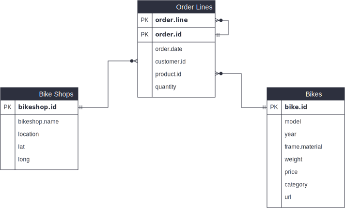

```{r setup, include=FALSE}
knitr::opts_chunk$set(message=FALSE,warning=FALSE, cache=TRUE)
```

**BUSINESS DATA SCIENCE BASICS**

This is an `.Rmd` file where all my work in R is recorded. The journal will consist of plain text, code blocks, and graphs/plots to illustrate completeness of the code.

The journal is divided into sections: one for each assignment (coding challenge). If you want to jump to a specific assignment, please refer to the table of contents in the top left part of the page.

Thank you, and I hope this is of any use to you. Enjoy!

# Assignment No. 1

*Last compiled:* **`r Sys.Date()`**


**Goal**

My responsibility is to study the products, look for opportunities to sell new products, and better serve the customer and market the products. All of this is supposed to be justified by data. For this I will delve into R with a real world situation.

The goal is to analyze the sales of bikes sold through bike stores in Germany. The bike models correspond to the models of the manufacturer Canyon. However, please note the sales and store data are made up for demonstration purposes.

For this, I will be importing, wrangling and visualizing the provided data (source of raw data is linked below). You may download the data in case you want to try this code on your own.

*Raw data source*:<br />
```{r echo=FALSE}

# multiple files
xfun::embed_files(c('../00_data/01_bike_sales/01_raw_data/bikes.xlsx',
                   '../00_data/01_bike_sales/01_raw_data/bikeshops.xlsx',
                   '../00_data/01_bike_sales/01_raw_data/orderlines.xlsx'), name = 'bike_sales.zip')

```


**Data**

The bike sales data is divided in multiple data sets for better understanding and organization. The Entity Relationship Diagram (ERD), which is used for describing and defining the data models, is shown below. It illustrates the logical structure of the databases.

<center>
{#id .class width=100% height=100%}<br />*Bike Sales Data ERD*<br /><br />
</center>

The data set has information of ~15k orders from 2015 to 2019 made from multiple bike stores in Germany. Its features allows viewing an order from multiple dimensions: from price to customer location, product attributes and many more.


## Step 1: Load libraries

As a first step, please load `tidyverse`, `readxl`, and `lubridate` libraries. For details on what these libraries offer, please refer to the comments in the code block below.

```{r}
# Work with File System
library(fs)           # working with the file system

# Import
library(readxl)       # reading excel files
library(writexl)      # saving data as excel files

# Tidy, Transform, & Visualize
library(lubridate)    # working with dates and times
library(tidyverse)
#  library(tibble)    --> is a modern re-imagining of the data frame
#  library(readr)     --> provides a fast and friendly way to read rectangular data like csv
#  library(dplyr)     --> provides a grammar of data manipulation
#  library(magrittr)  --> offers a set of operators which make your code more readable (pipe operator)
#  library(tidyr)     --> provides a set of functions that help you get to tidy data
#  library(stringr)   --> provides a cohesive set of functions designed to make working with strings easy
#  library(ggplot2)   --> graphics

# Other
library(devtools)    # used to install non-CRAN packages
```

If you haven't installed these packages, please install them by calling `install.packages(`*[name_of_package]*`)` in the R console. After installing, run the above code block again.


## Step 2: Import Files

Read excel files and store the data structure as a tibble. A good convention is to use the file name and suffix it with tbl.

```{r}
bikes_tbl <- read_excel(path = "../00_data/01_bike_sales/01_raw_data/bikes.xlsx")
orderlines_tbl <- read_excel("../00_data/01_bike_sales/01_raw_data/orderlines.xlsx")
bikeshops_tbl  <- read_excel("../00_data/01_bike_sales/01_raw_data/bikeshops.xlsx")
```


## Step 3: Examine Data

It's a good practice to take a look and get afeel of the data by examining it. I find two methods to be the most useful:
<ul>
<li>*Method 1*: Printing it to the console</li>
<li>*Method 2*: Running `glimpse()` function - helpful for wide data (data with many columns)</li>
</ul>

**Method 1**

```{r}
orderlines_tbl
```

**Method 2**

```{r}
glimpse(orderlines_tbl)
```


## Step 4: Manipulate Data by Joining

This is where the ERD comes into play. As you know from the ERD, there are certain entities that relate through one another. That's denoted by the connectors shown in the ERD image above. We start by merging order items and producs, and then we chain all joins together. A new variable called `bike_orderlines_joined_tbl` is stored in the Global Environment.

```{r}
# Chaining commands with the pipe and assigning it to order_items_joined_tbl
bike_orderlines_joined_tbl <- orderlines_tbl %>%
  left_join(bikes_tbl, by = c("product.id" = "bike.id")) %>%
  left_join(bikeshops_tbl, by = c("customer.id" = "bikeshop.id"))

# Examine the results with glimpse()
bike_orderlines_joined_tbl %>% glimpse()
```


## Step 5: Wrangle Data

The data requires more manipulation and further cleaning in order to visualize the data properly. The objective of this assignment is to create a wrangled object to analyze sales by location (state). To examine how the state is recorded in the data, it'd be wise to get unique elements of the `location` column of `bike_orderlines_joined_tbl`.

```{r}
bike_orderlines_joined_tbl$location %>% unique()
```


Afterwards, a set of actions are performed as shown below. Please note all actions are chained with the pipe already. However, each step can be performed separately with use `glimpse()` for code validation.

```{r}
# Store the result in a variable at the end of the steps.
bike_orderlines_wrangled_tbl <- bike_orderlines_joined_tbl %>%
  separate(col = location,
           into = c("city", "state"),
           sep = ", ") %>%
  
  # Add the total price (price * quantity) 
  # Add a column to a tibble that uses a formula-style calculation of other columns
  mutate(total.price = price * quantity) %>%
  
  # Reorder the data by selecting the columns in desired order.
  select(order.id, contains("order"), contains("model"), contains("state"),
         contains("city"), price, quantity, total.price,
         everything()) %>%
  
  # Rename columns to replace 'name' with 'bikeshop' and dots with underscores
  # (one at the time vs. multiple at once)
  rename(bikeshop = name) %>%
  set_names(names(.) %>% str_replace_all("\\.", "_"))
```


## Step 6: Visualize Data Through Insights

### Sales by State (Part 1)

In order to analyze the sales by state, we first need to manipulate the data a bit more, so it can be visualized correctly. The results are stored in the `sales_by_loc_tbl` tibble. Both data manipulation and visualization for the first part of the assignment is shown below.


**Manipulate**

```{r}
# Manipulate the data and store result
sales_by_loc_tbl <- bike_orderlines_wrangled_tbl %>%
  
  # Select columns
  select(contains("state"), total_price) %>%
  
  # Grouping by year and summarizing sales
  group_by(state) %>% 
  summarize(sales = sum(total_price)) %>%
  arrange(desc(sales)) %>%
  # Optional: Add a column that turns the numbers into a currency format 
  # (makes it in the plot optically more appealing)
  # mutate(sales_text = scales::dollar(sales)) <- Works for dollar values
  mutate(sales_text = scales::dollar(sales, big.mark = ".", 
                                     decimal.mark = ",", 
                                     prefix = "", 
                                     suffix = " €"))

sales_by_loc_tbl
```


**Visualize**

```{r plot1, fig.width=10, fig.height=7}
sales_by_loc_tbl %>%
  # Setup canvas with the columns state (x-axis) and sales (y-axis)
  # States are reordered in decreasing sales for a better visual (e.g. similar to Pareto chart)
  ggplot(aes(x = reorder(state,-sales), y = sales)) +
  # Rotate the x-axis labels
  theme(axis.title.x = element_text(), axis.text.x = element_text(angle = 45, hjust = 1)) +
  
  # Geometries
  geom_col(fill = "#2D303E") + # Use geom_col for a bar plot and fill with color
  # Adding labels to the bars along with formatting for better presentation
  geom_text(aes(label = sales_text), position = position_dodge(width = 0.9), 
          hjust = -0.1, size = 2.5, show.legend = FALSE, angle = 90) +
  
  # Formatting and re-scaling the y-axis
  # Again, we have to adjust it for euro values
  scale_y_continuous(expand = c(0,0), limits = c(0,25000000),
                     labels = scales::dollar_format(big.mark = ".", 
                                                    decimal.mark = ",", 
                                                    prefix = "", 
                                                    suffix = " €")) +
  
  # Final touches to the plot to ensure titles/subtitles are present
  labs(title    = "Revenue by State",
       subtitle = "Ordered from most to least total revenue",
       x = "State", # Changes the x-axis name
       y = "Revenue")
```


### Sales by State and Year (Part 2)

In efforts to analyze the sales by state and year, the data needs to be manipulated differently, so it can be visualized correctly. For that, the results are stored in a different tibble: `sales_by_loc_year_tbl`. Both data manipulation and visualization for the second part of the assignment is shown below.


**Manipulate**

```{r}
# Manipulate the data and store result
sales_by_loc_year_tbl <- bike_orderlines_wrangled_tbl %>%
  
  # Select columns
  select(order_date, contains("state"), total_price) %>%
  
  # Add year column
  # Note the year() function runs if "lubridate" package was run via library() function
  mutate(year = year(order_date)) %>%
  
  # Grouping by state and year and summarizing sales
  group_by(state, year) %>% 
  summarize(sales = sum(total_price)) %>%
  arrange(year) %>% 
  ungroup() %>%
  
  # Format $ Text
  mutate(sales_text = scales::dollar(sales, big.mark = ".", 
                                     decimal.mark = ",", 
                                     prefix = "", 
                                     suffix = " €"))

sales_by_loc_year_tbl
```


**Visualize**

```{r plot2, fig.width=10, fig.height=7}
sales_by_loc_year_tbl %>%
  # Setup canvas with the columns year (x-axis), sales (y-axis) and state (fill)
  ggplot(aes(x = year, y = sales, fill = state)) +
  # Rotate the x-axis labels
  theme(axis.title.x = element_text(), axis.text.x = element_text(angle = 45, hjust = 1),
        legend.position="top") +
  
  # Geometries
  geom_col() + # Use geom_col for a bar plot
  
  # Facet
  facet_wrap(~ state, nrow = 2) +
  
  # Adding labels to the bars along with formatting for better presentation
  geom_text(aes(label = sales_text), position = position_dodge(width = 0.9), 
            hjust = -0.1, size = 2.5, show.legend = FALSE, angle=90) +
  
  # Formatting and re-scaling the y-axis
  # Again, we have to adjust it for euro values
  scale_y_continuous(expand = c(0,0), limits = c(0,7500000),
                     labels = scales::dollar_format(big.mark = ".", 
                                                    decimal.mark = ",", 
                                                    prefix = "", 
                                                    suffix = " €")) +
  
  # Final touches to the plot to ensure titles/subtitles are present
  labs(title = "Revenue by State and Year",
       x = "Year",
       y = "Revenue",
       # Changes the legend name
       fill = "State")
```


# Assignment No. 2

Write text here...

# Assignment No. 3

Write text here...

# Assignment No. 4

Write text here...


## Second level header

You can add more headers by adding more hashtags. These won't be put into the table of contents

### third level header


Here's an even lower level header

# My second post (note the order)

Last compiled: `r Sys.Date()`

I'm writing this tutorial going from the top down. And, this is how it will be printed. So, notice the second post is second in the list. If you want your most recent post to be at the top, then make a new post starting at the top. If you want the oldest first, do, then keep adding to the bottom

# Adding R stuff

So far this is just a blog where you can write in plain text and serve your writing to a webpage. One of the main purposes of this lab journal is to record your progress learning R. The reason I am asking you to use this process is because you can both make a website, and a lab journal, and learn R all in R-studio. This makes everything really convenient and in the same place.

So, let's say you are learning how to make a histogram in R. For example, maybe you want to sample 100 numbers from a normal distribution with mean = 0, and standard deviation = 1, and then you want to plot a histogram. You can do this right here by using an r code block, like this:

```{r}
samples <- rnorm(100, mean=0, sd=1)
hist(samples)
```

When you knit this R Markdown document, you will see that the histogram is printed to the page, along with the R code. This document can be set up to hide the R code in the webpage, just delete the comment (hashtag) from the cold folding option in the yaml header up top. For purposes of letting yourself see the code, and me see the code, best to keep it the way that it is. You'll learn that all of these things and more can be customized in each R code block.
